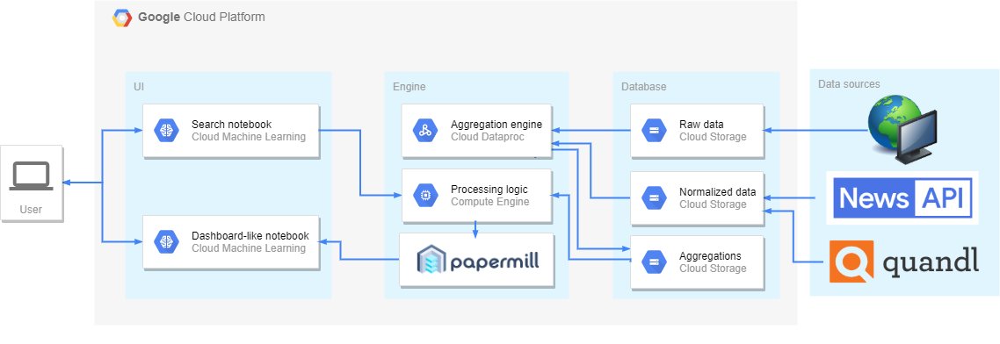

# Dynamic Dashboards Generator
This POC uses Jupyter notebooks to build dynamic dashboards.
The user types a natural language search query via the search notebook
and the application returns an interactive dashboard (a separate notebook)
containing multiple charts with data corresponding to the user's query.

The design was presented in detail in [a dedicated Medium post](https://towardsdatascience.com/creating-notebook-based-dynamic-dashboards-91f936adc6f3).

The POC architecture is the following:

